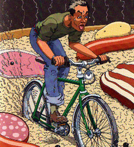
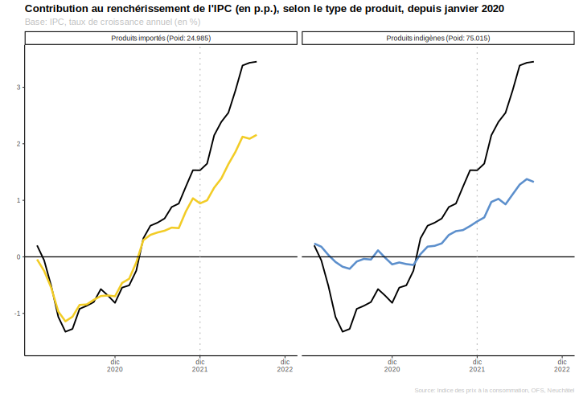
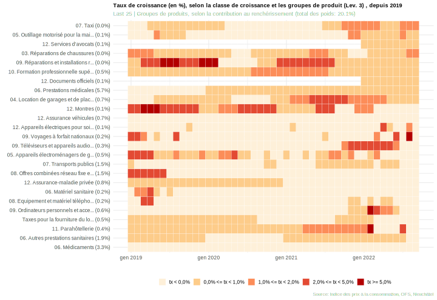

---
output:
  xaringan::moon_reader:
    css: [default, "metropolis_ustat.css", "metropolis-fonts", "specifici.css"]
    lib_dir: immagini
    nature:
      highlightStyle: github
      highlightLines: true
      countIncrementalSlides: false
      ratio: 16:9
    seal: false
    includes:
      after_body: insert-logo.html
---


```{r setup, include=FALSE}
rm(list=ls())

options(htmltools.dir.version = FALSE)

knitr::opts_chunk$set(fig.width=4.25, fig.height=3.5, fig.retina=3,
                      message=FALSE, warning=FALSE, cache = TRUE, 
                      autodep = TRUE, hiline=TRUE
                      , dev = "svg"
                      )

options(knitr.kable.NA = '')
source(file = "Figure.R", encoding = "UTF-8")

```

class: title-slide clear


# **Pédaler dans la choucroute**
## *...et l’indice des prix à la consommation*

<br>


### Eric Stephani (Ufficio di statistica)
### .font80[Journées suisses de la statistique]
### .font80[**Nouvelles pistes pour la communication II**]

### .mid-warm-grey[.font80[*Lucerne, mercredi 26 octobre*]]

---

# Suivre l'indice des prix à la consommation (IPC)

.pull-left[

##### Image, idée
.img-left[

]

.font70[
.hl[Pédaler dans la choucroute]  

.font60[
.mid-warm-grey[(Figuré)] *Patauger, perdre ses moyens, perdre le fil de ses gestes, de ses pensées, de ses paroles.* .mid-warm-grey[(Expression populaire)] *Se démener sans avancer.*

]
]
]

--

.pull-right[
##### Sommaire
.font80[
- IPC dans le temps  
- Taux de croissance de l'IPC, par groupe de produits et contribution au renchérissement    
- Effets et perceptions du renchérissement

]
]

---
class: hide-logo, inverse, center, middle

# L'indice des prix à la contribution (indice base 100)

---
class: clear

.font70[
.left-column[
#### IPC (2020 = 100), 2015-2022

]
]

--

.right-column[


]

---
class: clear

.font70[
.left-column[
#### IPC (2020 = 100), 2015-2022
#### IPC (2010 = 100), 2005-2022

]
]


.right-column[

]

---
class: clear

.font70[
.left-column[
#### IPC (2020 = 100), 2015-2022
#### IPC (2010 = 100), 2005-2022
#### IPC (1987 = 100), 1985-2022

]
]


.right-column[

]

---
class: clear

.font70[
.left-column[
#### IPC (2020 = 100), 2015-2022
#### IPC (2010 = 100), 2005-2022
#### IPC (1987 = 100), 1985-2022
#### 1985-1992 vs 2018-2025

]
]


.right-column[

]

---
class: clear

.font70[
.left-column[
#### IPC (2020 = 100), 2015-2022
#### IPC (2010 = 100), 2005-2022
#### IPC (1987 = 100), 1985-2022
#### Comparaison, 1985-1992 vs 2018-2025
#### Comparaison des taux de croissance

]
]


.right-column[


]

---
class: clear

.font60[
.mid-warm-grey[
.left-column[
- L'evolution des prix est-elle préoccupante?
<br>
- L'évolution des prix est-elle incontrôlable?
<br>
- La situation actuelle ressemble-t-elle davantage à la période 2007-2010 ou à la période 1987-1992?

]
]
]

.img-left[]

--

<br>
.right-column[
Ces questions sont-elles les plus urgentes?

]

--

.right-column[
.pull-left[
OUI
]

.pull-right[
.hl[NON]
]
]

---
class: hide-logo, inverse, center, middle

# Le taux de croissance de l'indice des prix à la consommation (IPC), selon le groupe de produits

---
class: clear

.font70[
.left-column[
#### IPC selon le type de produits

]
]


.right-column[

]

---
class: clear

.font70[
.left-column[
#### IPC selon le type de produits
#### IPC selon la provenance des produits

]
]


.right-column[

]

---
class: clear

.font70[
.left-column[
#### IPC selon le type de produits
#### IPC selon la provenance des produits
#### IPC et "core" inflation

]
]


.right-column[

]

---
class: clear

.font70[
.left-column[
#### IPC selon le type de produits
#### IPC selon la provenance des produits
#### IPC et "core" inflation
#### Énergie et carburants

]
]


.right-column[

]

---
class: clear

.font70[
.left-column[
#### IPC selon le type de produits
#### IPC selon la provenance des produits
#### IPC et "core" inflation
#### Énergie et carburants
#### IPC, groupes principaux

]
]


.right-column[


]

---
class: clear

.font70[
.left-column[
#### L'inflation actuelle

<br>
.img-left[]

]
]

--

.right-column[
<br>
#### **La solution**

.font70[
- Inflation importée  
- Inflation gonflée et soutenue par les prix de l'énergie et des carburants

]
]

--

.right-column[

#### Mais... si on regarde les poids

.font80[
- Poids des produits importés: 24,98%
- Poids de l'énergie et des carburants: 5,47%

]
]


---
class: hide-logo, inverse, center, middle

# Contribution au renchérissement, selon le groupe de produits

---
class: clear

.font70[
.left-column[
#### Contribution, selon le type de produits

]
]


.right-column[

]

---
class: clear

.font70[
.left-column[
#### Contribution, selon le type de produits
#### Contribution, selon la provenance des produits

]
]


.right-column[


]

---
class: clear

.font70[
.left-column[
#### Contribution, selon le type de produits
#### Contribution, selon la provenance des produits
#### Contribution et "core" inflation

]
]


.right-column[

]

---
class: clear

.font70[
.left-column[
#### Contribution, selon le type de produits
#### Contribution, selon la provenance des produits
#### Contribution et "core" inflation
#### Contribution aux prix de l'énergie, selon le type de produits

]
]


.right-column[


]

---
class: clear

.font70[
.left-column[
#### Contribution, selon le type de produit
#### Contribution, selon la provenance des produits
#### Contribution et "core" inflation
#### Contribution aux prix de l'énergie, selon le type de produit
#### Contributions "minimales", exemple

]
]


.right-column[

]

---
class: hide-logo, inverse, center, middle

# Le taux de croissance de l'IPC et contribution au renchérissement

---
class: clear

.font70[
.left-column[
#### Évolution de l'IPC, selon la classe de croissance

]
]


.right-column[

]

---
class: clear

.font70[
.left-column[
#### Évolution de l'IPC, selon la classe de croissance
#### Level 2

]
]


.right-column[


]

---
class: clear

.font70[
.left-column[
#### Évolution de l'IPC, selon la classe de croissance
#### Level 2
#### Level 3, first 25

]
]


.right-column[

]

---
class: clear

.font70[
.left-column[
#### Évolution de l'IPC, selon la classe de croissance
#### Level 2
#### Level 3, first 25
#### Level 3, last 25

]
]


.right-column[


]

---
class: clear

.font70[
.left-column[
#### Évolution de l'IPC, selon la classe de croissance
#### Level 2
#### Level 3, last 25
#### Level 3, first 25
#### Level 4, first 25

]
]


.right-column[

]

---

class: middle clear

### Suivre l'IPC

.mid-warm-grey[
.font80[
Point de départ

]
]

--

.pull-left[
##### L'IPC, total
.img.left[]
.font70[
Résultats de plus en plus préoccupants:  
- Taux de croissance de plus en plus hautes   
- Situation qui a changée très vite  
- Similitudes par rapport à un période relativement eloignée

]
]

--

.pull-right[
##### L'IPC, décomposée
.img-left[]

.font70[
Résultats de plus en plus préoccupants, .hl[mais]:   
- il y a les taux de croissance et les poids  
- il y a plusieurs niveau d'analyse

]
]

---

class: hide-logo, inverse, center, middle

# L’enquête sur le climat de consommation (SECO, Bern)

---
class: clear

.font70[
.left-column[
#### IPC et son perception

]
]


.right-column[


]

---
class: clear

.font70[
.left-column[
#### IPC et son perception
#### IPC, son perception et correlation

]
]


.right-column[


]

---
class: clear

.font70[
.left-column[
#### IPC et son perception
#### IPC, son perception et correlation
#### IPC et situation financière

]
]


.right-column[


]

---
class: clear

.font70[
.left-column[
#### IPC et son perception
#### IPC, son perception et correlation
#### IPC et situation financière
#### IPC et grand acquisition

]
]


.right-column[


]


---
# Conclusion

.pull-left[
###### Pedaler dans la choucroute, .grey[*hier*]
<br>
.img-left[ ]

]

--

.pull-right[

###### Pedaler dans la choucroute, .hl[maintenant]
<br>
.img-left[ ]

]


---

# IPC et USTAT

.left-column[
###### Articles
###### Projets

]


.right-column[

  

.font80[
**Articles**  
*"Bisweilen scheint es, die Statistiker verlören sich in den Medien, die Medien verlören sich in den Statistiken und es gehen im Dschungel der Zahlen nicht nur alle, sondern alles verloren. Das muss nicht sein."*
]
.font60[.mid-warm-grey[*Beat Glogger*, autore e giornalista scientifico. Journées suisses de la statistique 2014, Yverdon les bains]]


.font40[
<br>
<br>
<br>
<br>
<br>
.mid-warm-grey[
Slides create con R via: [{r-project}](https://www.r-project.org) e [{xaringan}](https://github.com/yihui/xaringan)

]
]
]

---

class: title-slide-fin clear hide-logo


# .white[.]

.font70[
.pull-right2[
.white[ ]  
Eric Stephani  
[eric.stephani@ti.ch](mailto:eric.stephani@ti.ch)  

.white[ ]  
Repubblica e Canton Ticino  
Divisione delle risorse  
**Ufficio di statistica**  
[www.ti.ch/ustat](http://www.ti.ch/ustat)

]
]

